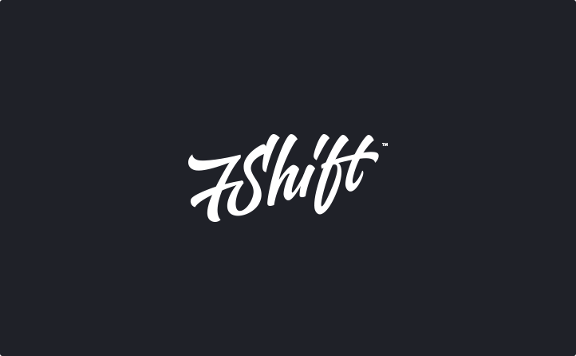

Curious is a super-awesome Tumblr theme with a clean, minimal design. If you're looking to get started with microblogging, then Curious will be right up your street. And it's responsive to boot. Show off quotes, links, video, audio or standard posts...

<strong>Responsive Design</strong> – Serve an optimised version of the theme to your visitors using tablet and mobile devices. Optimised for iPad and iPhone.

<a href="https://github.com/7Shift/Curious/wiki/Theme-Features">(See Full Features)</a>

<h2>How to install the theme?</h2>

Please visit <a href="https://github.com/7Shift/Curious/wiki/Installation">Curious Wiki Pages</a> for the installation instructions.

<h2>Need help?</h2>

Visit the <a href="https://github.com/7Shift/Curious/issues">GitHub Issues</a> for prompt support.

<em>Support for all our themes is conducted through the <a href="https://github.com/7Shift/Curious/issues">GitHub Issues</a> pages.</em> If you have any questions, feel free to pose them in there.

<h2>Sources and Credits</h2>

Please visit <a href="https://github.com/7Shift/Curious/wiki/Sources-and-Credits">Curious Wiki Pages</a> for the used materials.

<h2>Thank you!</h2>

A huge thanks for purchasing this theme, your support is truly appreciated!
